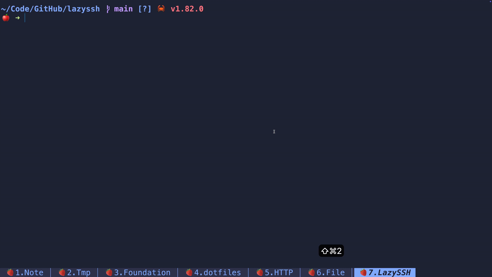

An ssh server manages tui tools.



## Install

### Use cargo

```bash
cargo install lazyssh
```

## Usage

Simply run the `lazyssh` command in the terminal（It is recommended to add a command alias for `lazyssh`, such as `s`）,
and the TUI program will list all remote servers. You can select a server using your mouse or keyboard. All server
information comes from the `~/.ssh/config` file.

## Shortcut

| Key             | Desc                        |
|-----------------|-----------------------------|
| Mouse click     | Select server               |
| j/↓             | Move down                   |
| k/↑             | Move up                     |
| g/Home          | Move to top                 |
| G/End           | Move to bottom              |
| /               | Enter search mode           |
| Ctrl+j/k or ↑/↓ | Move down/up in search mode |
| Backspace       | Delete search query chars   |
| Esc             | Exit search mode            |
| Enter           | Perform SSH login           |
| q               | Exit                        |

## ~/.ssh/config file Example

```
Host product
    HostName 192.168.10.10
    User root
    Port 22
    PreferredAuthentications publickey
    IdentityFile ~/.ssh/keys/product
Host ubuntu
    HostName 49.235.30.166
    User root
    Port 22
    PreferredAuthentications publickey
    IdentityFile ~/.ssh/keys/ubuntu
Host k8s_master
    HostName 192.168.19.200
    User root
    Port 22
    PreferredAuthentications publickey
    IdentityFile ~/.ssh/keys/k8s_master
Host dev_node1
    HostName 192.168.20.21
    User root
    Port 22
    PreferredAuthentications publickey
    IdentityFile ~/.ssh/keys/dev_node1
Host dev_node2
    HostName 192.168.20.34
    User root
    Port 22
    PreferredAuthentications publickey
    IdentityFile ~/.ssh/keys/dev_node2
Host dev_node3
    HostName 192.168.20.57
    User root
    Port 22
    PreferredAuthentications publickey
    IdentityFile ~/.ssh/keys/dev_node3
```

```
$ tree ~/.ssh
/Users/jing/.ssh
├── config
├── keys
│   ├── product
│   ├── product.pub
│   ├── ubuntu
│   ├── ubuntu.pub
│   ├── k8s_master
│   ├── k8s_master.pub
│   ├── dev_node1
│   ├── dev_node1.pub
│   ├── dev_node2
│   ├── dev_node2.pub
│   ├── dev_node3
│   └── dev_node3.pub
└── known_hosts
```

## Tips

- You can use `ssh-keygen -t rsa -b 4096 -C youremail@xxx.com` to generate the private and public key.
- You can use `ssh-copy-id -i xxx.pub -p 22 yourusername@x.x.x.x` to send the public key to the remote server.
- You can log in to multiple remote servers using one pair of public and private keys.
- You can upload your `~/.ssh` folder to a git **private** repository.
