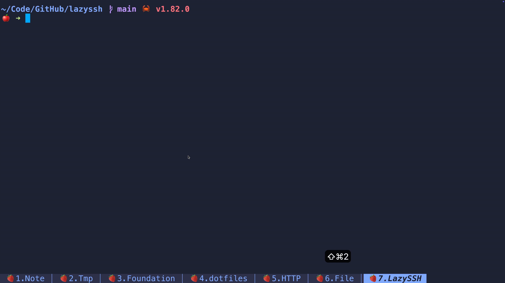

An ssh server manages tui tools.



## Install

```bash
cargo install lazyssh
```

## Usage

Simply run the `lazyssh` command in the terminal, and the TUI program will list all remote servers. Use `j`/`k` to
navigate up and down, press `Enter` to automatically execute SSH login to the selected remote server, and press `q` to
exit the TUI program. All server information comes from the `~/.ssh/config` file.

## ~/.ssh/config Example

```
Host product
    HostName 192.168.10.10
    User root
    PreferredAuthentications publickey
    IdentityFile ~/.ssh/keys/product
Host ubuntu
    HostName 49.235.30.166
    User root
    PreferredAuthentications publickey
    IdentityFile ~/.ssh/keys/ubuntu
Host k8s_master
    HostName 192.168.19.200
    User root
    PreferredAuthentications publickey
    IdentityFile ~/.ssh/keys/k8s_master
Host dev_node1
    HostName 192.168.20.21
    User root
    PreferredAuthentications publickey
    IdentityFile ~/.ssh/keys/dev_node1
Host dev_node2
    HostName 192.168.20.34
    User root
    PreferredAuthentications publickey
    IdentityFile ~/.ssh/keys/dev_node2
Host dev_node3
    HostName 192.168.20.57
    User root
    PreferredAuthentications publickey
    IdentityFile ~/.ssh/keys/dev_node3
```

- You can use `ssh-keygen -t rsa -b 4096 -C youremail@xxx.com` to generate the private and public key.
- You can use `ssh-copy-id -i xxx.pub -p 22 yourusername@x.x.x.x` to send the public key to the remote server.

```
$ tree ~/.ssh
/Users/jing/.ssh
├── config
├── keys
│   ├── product
│   ├── product.pub
│   ├── ubuntu
│   └── ubuntu.pub
│   ├── k8s_master
│   └── k8s_master.pub
│   ├── dev_node1
│   └── dev_node1.pub
│   ├── dev_node2
│   └── dev_node2.pub
│   ├── dev_node3
│   └── dev_node3.pub
├── known_hosts
```
